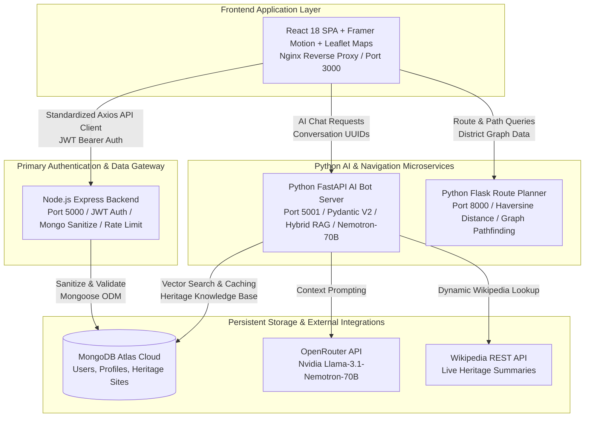

# 🏛️ Thamizh Thadam — AI-Powered Heritage Guide & Smart Navigation System

[](https://github.com)
[](./docker-compose.yml)
[](#-system-architecture)
[](#-enterprise-security-hardening)

**Thamizh Thadam** is a full-stack, enterprise-grade AI heritage platform designed to help tourists, historians, and cultural enthusiasts explore **Tamil Nadu’s architectural and historical treasures** — including Chola temples, Pandiyan forts, memorials, and ancient monuments.

The system combines a **React 18 single-page application**, a **hardened Node.js/Express API gateway & authentication service**, an **asynchronous Python FastAPI AI Chatbot & Knowledge Engine**, and a **Python Flask Smart Heritage Route Planner** into an integrated, production-ready microservice ecosystem.

---

## 🏗️ System Architecture

The application uses a **Tripartite Distributed Backend Architecture** communicating with a responsive React frontend over standardized HTTP REST APIs with token-based authentication and structured JSON logging.



---

## 🚀 Key Enterprise Features

- **🗂️ Curated Heritage Sites Catalog:** Browse verified temples, forts, memorials, and cultural monuments with high-resolution imagery and historical timelines.
- **🤖 Intelligent Hybrid RAG Chatbot:** Powered by Nvidia's `Llama-3.1-Nemotron-70B` via OpenRouter with local MongoDB vector search and real-time Wikipedia fallback synthesis.
- **🗺️ Geo-Spatial Route Planning:** Calculate optimal travel sequences across heritage districts using Haversine distance matrices and nearest-neighbor graph pathfinding.
- **🔐 Defense-in-Depth Security:** Multi-layered security including HTTP Parameter Pollution prevention (`hpp`), Helmet security headers, MongoDB NoSQL injection sanitization (`express-mongo-sanitize`), dual-framework rate limiting, and bcrypt password hashing.
- **📊 Observability & Distributed Tracing:** Standardized JSON logging across all Node.js and Python servers with automatic `X-Request-ID` propagation and API response time (`durationMs`) tracking.

---

## 🔐 Enterprise Security Hardening

The application is hardened against OWASP Top 10 vulnerabilities through the following mechanisms:

| Security Layer | Implementation Details |
| :--- | :--- |
| **Authentication & Session Security** | JWT-based authentication (`jsonwebtoken`) with strict 7-day token expiry. Passwords hashed using bcrypt with 10 work factors. Automatic frontend token invalidation on HTTP 401. |
| **NoSQL Injection Defense** | Input sanitization using `express-mongo-sanitize` to strip `$` and `.` operators from query payloads. Strict Pydantic V2 schemas for Python API endpoints. |
| **HTTP Parameter Pollution (HPP)** | Integrated `hpp` middleware to prevent array-injection parameter pollution attacks on search and pagination queries. |
| **HTTP Security Headers** | Helmet-equivalent headers (`X-Frame-Options: DENY`, `X-XSS-Protection`, `X-Content-Type-Options: nosniff`, `Content-Security-Policy`) enforced on all API responses. |
| **Rate Limiting & DoS Protection** | Enterprise API rate limiting via `express-rate-limit` (100 req/15min for general APIs, 5 req/15min for Auth APIs) and token-bucket middleware for Python FastAPI/Flask endpoints. |

---

## ⚙️ Environment Variables Reference

Copy `.env.example` to `.env` in the project root and configure the following variables before running the application:

| Variable Name | Required | Default Value | Description |
| :--- | :---: | :--- | :--- |
| `NODE_ENV` | Yes | `production` | Runtime environment (`development`, `production`). |
| `PORT` | Yes | `5000` | Port for the Node.js Express Backend. |
| `MONGO_URI` | Yes | *None* | Secure MongoDB Atlas connection string. |
| `JWT_SECRET` | Yes | *None* | Secret key for signing JWT tokens (min 64 chars). |
| `FASTAPI_PORT` | No | `5001` | Port for the Python AI Bot Server. |
| `FLASK_PORT` | No | `8000` | Port for the Python Route Planner Server. |
| `CORS_ORIGINS` | No | `http://localhost:3000` | Comma-separated allowed frontend origins. |
| `OPENROUTER_API_KEY`| Yes | *None* | API key for OpenRouter AI inference. |
| `NEMOTRON_MODEL` | No | `nvidia/llama-3.1...` | AI model identifier used for RAG generation. |
| `REACT_APP_API_URL`| No | `http://localhost:5000` | Base URL for Node.js Backend endpoints. |
| `REACT_APP_AI_URL` | No | `http://localhost:5001` | Base URL for Python AI Bot endpoints. |
| `REACT_APP_ROUTE_URL`| No | `http://localhost:8000` | Base URL for Python Route Planner endpoints. |

---

## 💻 Local Development Setup

### 1. Prerequisites
- **Node.js**: v20.x or higher
- **Python**: v3.11 or higher
- **MongoDB**: Access to a MongoDB Atlas cluster or local MongoDB instance

### 2. Manual Multi-Terminal Development
#### A. Start Node.js Express Backend
```bash
cd backend
npm install
npm run dev
```

#### B. Start Python FastAPI AI Bot Server
```bash
cd ai_server
python -m venv venv
# Windows: venv\Scripts\activate | Linux/Mac: source venv/bin/activate
pip install -r requirements.txt
python bot_server.py
```

#### C. Start Python Flask Route Planner Server
```bash
cd ai_server
python app.py
```

#### D. Start React Frontend
```bash
cd frontend
npm install
npm start
```

---

## 🐳 Docker Compose Production Deployment

The repository includes a complete containerized production setup using **Docker Compose** with multi-stage React/Nginx builds, unprivileged non-root container execution, and automated health checks.

### 1. Launch Full Stack with Docker Compose
Ensure Docker Desktop or Docker Engine is running, then execute:

```bash
# Build and launch all 4 services in detached mode
docker compose up -d --build
```

### 2. Verify Container Health & Services
Check that all containers are healthy and communicating over the `heritage-net` bridge network:

```bash
docker compose ps
```

| Service Name | Container Name | Exposed Port | Healthcheck Endpoint |
| :--- | :--- | :--- | :--- |
| **Frontend SPA (Nginx)** | `thamizh-thadam-frontend` | `http://localhost:3000` | `/` (HTTP 200) |
| **Node.js API Gateway** | `thamizh-thadam-node-backend` | `http://localhost:5000` | `/ping` |
| **Python AI Bot Server** | `thamizh-thadam-ai-bot` | `http://localhost:5001` | `/api/health` |
| **Python Route Planner** | `thamizh-thadam-route-planner`| `http://localhost:8000` | `/api/districts` |

---

## 🌐 Production Deployment Guide

When deploying **Thamizh Thadam** to cloud environments (AWS EC2, GCP Compute Engine, Azure VM, or Kubernetes):

### 1. Reverse Proxy & SSL/TLS Termination (Nginx / Cloudflare)
- Use an external edge reverse proxy (e.g., **Cloudflare**, **AWS ALB**, or host Nginx with **Let's Encrypt / Certbot** SSL certificates) to terminate HTTPS on port `443`.
- Route traffic as follows:
  - `https://yourdomain.com/*` → Frontend Nginx container (`localhost:3000`)
  - `https://yourdomain.com/api/*` → Node.js API Gateway container (`localhost:5000`)
  - `https://yourdomain.com/ai/*` → Python AI Bot Server container (`localhost:5001`)
  - `https://yourdomain.com/route/*` → Python Route Planner container (`localhost:8000`)

### 2. Zero-Downtime Rollbacks & Container Logs
- **Log Aggregation:** All containers emit structured JSON logs to standard output with `X-Request-ID` propagation. Collect logs using **Datadog**, **AWS CloudWatch**, or **FluentBit/ELK**.
- **Container Rollback:** Should an update cause a failure, roll back instantly by reverting to the previous Docker image tag:
  ```bash
  docker compose pull
  docker compose up -d --force-recreate
  ```

---

## 👨‍💻 Authors & Contributors

- **Naresh** — UI/UX & Frontend Development 
- **Hari Ragavendra** — Enterprise Security, Backend & Cloud DevOps
- **Ruparagunath** — AI & RAG System
